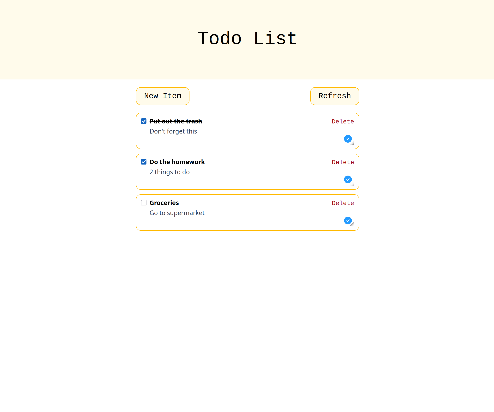

# Todo app



This is a personal project to build a full-stack application from scratch in Rust.

Features :
- Add, remove and modify a task
- OpenID connect (implemented from scratch)

Technologies are :
|Name|Description|
|---|---|
|Yew|Frontend framework|
|Tailwind|CSS framework|
|Rocket|Backend framework|
|Diesel|Database ORM|
|Sqlite|Database|

# Run it
Download the [compose.yml](./compose.yml) and run :
```sh
docker compose up -d
```

# Development
Setup :
```sh
cargo install trunk --locked
rustup target add wasm32-unknown-unknown
```

Run with :
```sh
# Backend
cd todoapp_backend
cargo run

# Frontend
cd todoapp_frontend
trunk serve
```